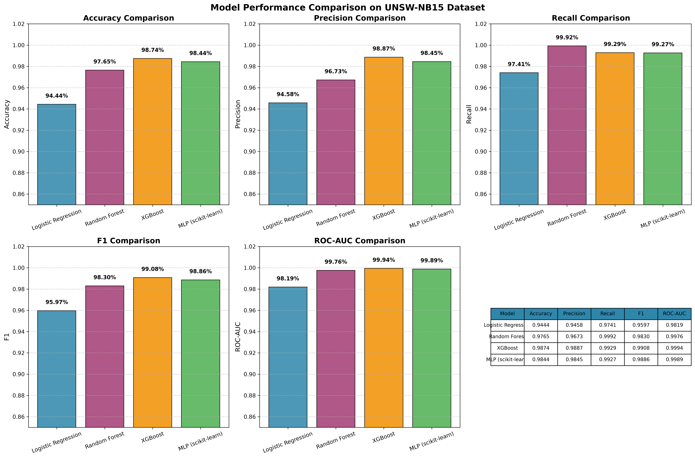

# Anomaly-Based Network Intrusion Detection System


An AI-powered cybersecurity project that learns the normal behavior of network traffic and flags suspicious activity as anomalies. It is designed for intrusion detection, attack identification, and research benchmarking using real-world traffic patterns.

---

## Project Overview

This system learns what healthy network traffic looks like and automatically detects abnormal flows that may indicate attacks such as reconnaissance, exploits, denial of service, or malware-related behavior. Instead of depending only on static signatures, the system uses machine learning to find novel patterns.

### Key Highlights

- Zero-day and unknown intrusion detection capability
- High-performing ML and deep learning models
- Built on UNSW-NB15 network traffic data
- Pretrained model files included for direct use
- Full reports and notebook workflow included

---

## Model Performance

The project compares multiple models on 257,673 network records and reports the best results for production use.

| Model                |  Accuracy  |  F1-Score  |
| :------------------- | :--------: | :--------: |
| **XGBoost**          | **98.74%** | **99.08%** |
| MLP (Neural Network) |   98.44%   |   98.86%   |
| Random Forest        |   97.65%   |   98.30%   |
| Logistic Regression  |   94.44%   |   95.97%   |

### Result Screenshot



---

## How It Works

```text
Network Traffic Data
        |
        v
[Data Cleaning & Preprocessing]
        |
        v
[Feature Extraction & Feature Selection]
        |
        v
[Machine Learning / Neural Network Training]
        |
        v
[Evaluation & Model Comparison]
        |
        v
[Anomaly / Attack Detection]
```

The pipeline includes data cleaning, feature engineering, model training, validation, and benchmarking using accuracy, precision, recall, F1-score, and ROC-AUC metrics.

---

## Repository Structure

```text
.
├── data/
│   ├── features/
│   ├── processed/
│   └── raw/
├── final_reports/
│   ├── final_summary_report.md
│   ├── technical_artifact.md
│   ├── model_performance_comparison.png
│   ├── model_performance_comparison.pdf
│   ├── model_comparison_with_mlp.csv
│   └── classical_model_comparison.csv
├── models/
│   ├── best_classical_model.pkl
│   └── mlp_sklearn_model.pkl
├── notebooks/
│   ├── 01_data_exploration.ipynb
│   ├── 02_preprocessing.ipynb
│   ├── 03_feature_engineering.ipynb
│   ├── 04_ml_models.ipynb
│   └── 05_dl_models.ipynb
├── requirements.txt
├── README.md
└── LICENSE
```

---

## Quick Start

### 1. Install dependencies

```bash
git clone https://github.com/DeepanshuGarhkoti109/Anomaly-Based-Network-Intrusion-Detection-System.git
cd Anomaly-Based-Network-Intrusion-Detection-System
python -m venv venv
venv\Scripts\activate      # Windows
# source venv/bin/activate # Linux/macOS
pip install -r requirements.txt
```

### 2. Load the pretrained model

```python
import joblib

model = joblib.load('models/best_classical_model.pkl')
scaler = joblib.load('data/processed/scaler.pkl')
selected_features = joblib.load('data/features/selected_features.pkl')
```

### 3. Explore notebooks

```bash
jupyter notebook notebooks/01_data_exploration.ipynb
```

---

## Reports

- [final_summary_report.md](final_reports/final_summary_report.md)
- [technical_artifact.md](final_reports/technical_artifact.md)
- [model_comparison_with_mlp.csv](final_reports/model_comparison_with_mlp.csv)
- [model_performance_comparison.pdf](final_reports/model_performance_comparison.pdf)

---

## Use Cases

- Network security monitoring
- Intrusion detection research
- Cybersecurity education and training
- AI-driven anomaly classification workflows

---

## License

MIT License. This project is open to use, modification, and distribution.

---

## Citation

If you use this project for research or academic work, please cite the UNSW-NB15 dataset and the repository documentation as appropriate.
